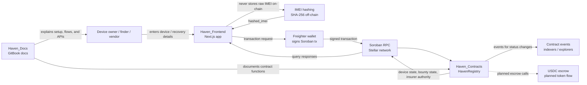
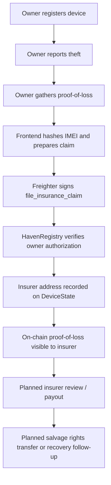
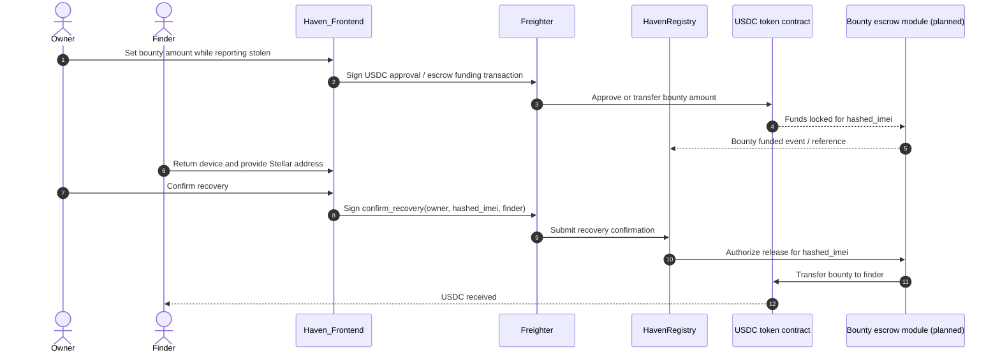

# System Architecture

Haven is split across three version-controlled repositories plus the wallet and Soroban services that connect a user action to an on-chain device record.

- **Haven_Frontend** — user interface, IMEI hashing helper, Freighter signing, and read/write client calls.
- **Haven_Contracts** — Soroban `HavenRegistry` contract modules for device registration, stolen-device reporting, recovery bounties, and insurance claim authority.
- **Haven_Docs** — GitBook documentation, user guides, contract references, and architecture notes.

## Repository and component map



## Core data flow

1. The frontend receives a raw IMEI from the user and hashes it off-chain with SHA-256.
2. Only the `hashed_imei` is sent to the contract; the raw IMEI should not be written to Soroban state.
3. Freighter signs the user's transaction before it is submitted through Soroban RPC.
4. `HavenRegistry` stores and updates the `DeviceState`, stolen flag, bounty amount, recovery contact, and insurer authority.
5. The frontend and future indexers read contract state/events to show verification, bounty, recovery, and insurance status.

## Bounty lifecycle sequence

This is the expected recovery-bounty flow from registration through finder payout. The current contract stores and clears bounty records; the USDC transfer is documented as the planned escrow integration.

```mermaid
sequenceDiagram
    autonumber
    actor Owner as Device owner
    participant FE as Haven_Frontend
    participant Wallet as Freighter
    participant Registry as HavenRegistry (Soroban)
    actor Finder as Finder / vendor
    participant Escrow as USDC escrow contract (planned)

    Owner->>FE: Enter IMEI and device metadata
    FE->>FE: Hash raw IMEI off-chain
    FE->>Wallet: Request signature for register_device(owner, hashed_imei, model)
    Wallet->>Registry: Submit signed registration transaction
    Registry-->>FE: Device registered

    Owner->>FE: Report stolen and choose bounty amount/contact
    FE->>Wallet: Request signature for report_stolen(owner, hashed_imei, bounty, contact)
    Wallet->>Registry: Submit stolen-device transaction
    Registry-->>FE: Device marked stolen; bounty record stored
    Registry-->>Escrow: Planned: lock owner-funded USDC bounty

    Finder->>FE: Verify device and contact owner
    Owner->>FE: Confirm recovered device and finder address
    FE->>Wallet: Request signature for confirm_recovery(owner, hashed_imei, finder)
    Wallet->>Registry: Submit recovery confirmation
    Registry-->>FE: Device status restored; bounty record cleared
    Registry-->>Escrow: Planned: release USDC to finder
```

## Insurance claim flow

Insurance claims create an auditable proof-of-loss path. Today the owner assigns an insurer address to the device record; future iterations can add claim IDs, insurer co-signatures, cooldowns, and salvage metadata.



## USDC escrow interactions

The escrow path is the target token-flow design for recovery bounties. It keeps the device registry as the source of truth for state transitions while a token contract handles USDC movement.



## Privacy and safety boundaries

- Raw IMEIs stay off-chain; only hashes are sent to Soroban.
- Wallet signatures are requested in the frontend but private keys remain in the user's wallet.
- The docs describe planned USDC escrow interactions separately from the currently implemented registry functions so readers can distinguish live behavior from roadmap behavior.
- Event/indexer consumers should treat contract events as public data and avoid storing raw recovery-contact details beyond what the user explicitly submits.

## Future integrations

- Freighter for B2B wallet flows.
- Passkey Kit for biometric onboarding.
- Launchtube for fee abstraction.
- SEP-24 anchors for fiat-to-USDC bounty funding.
- Indexers for device status, recovery, bounty, and insurance event history.
