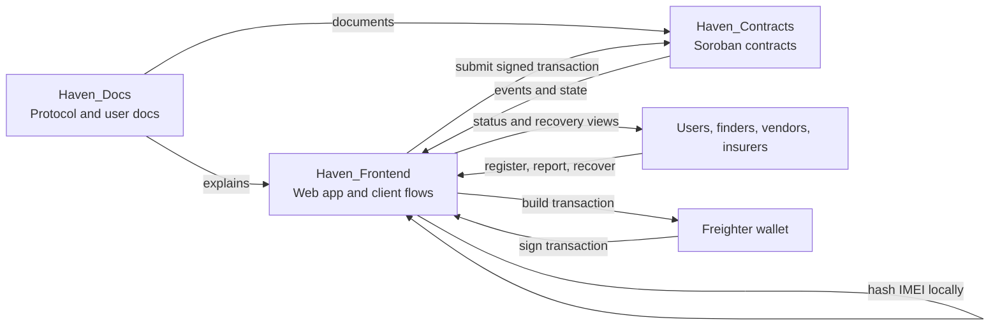
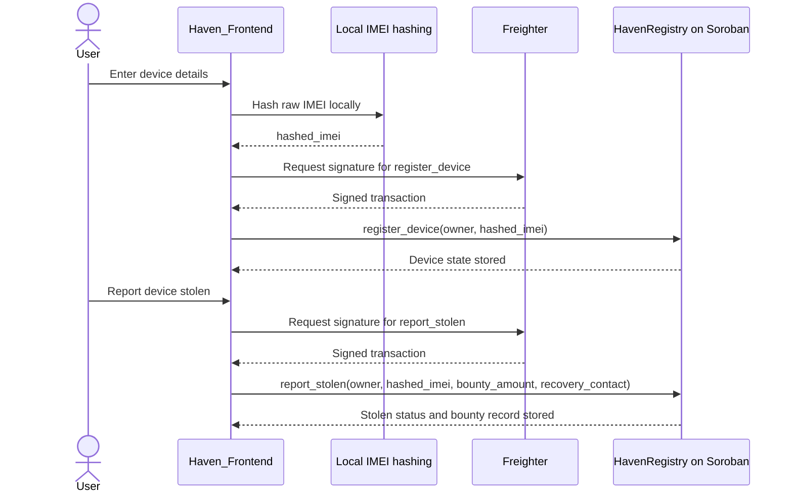
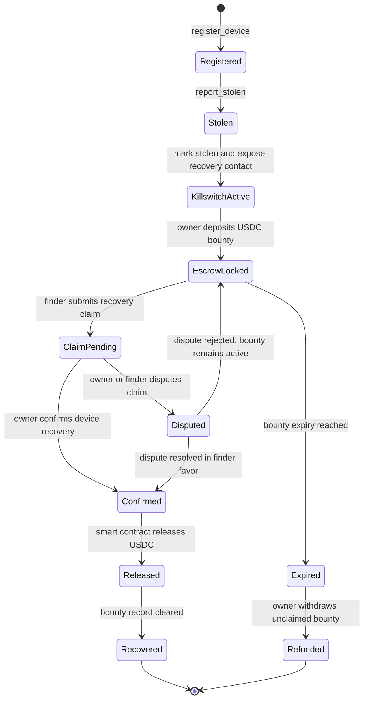
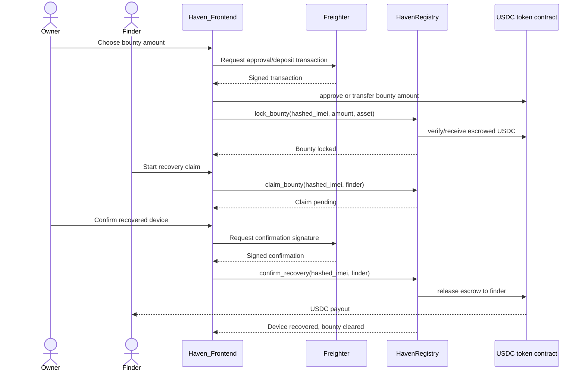
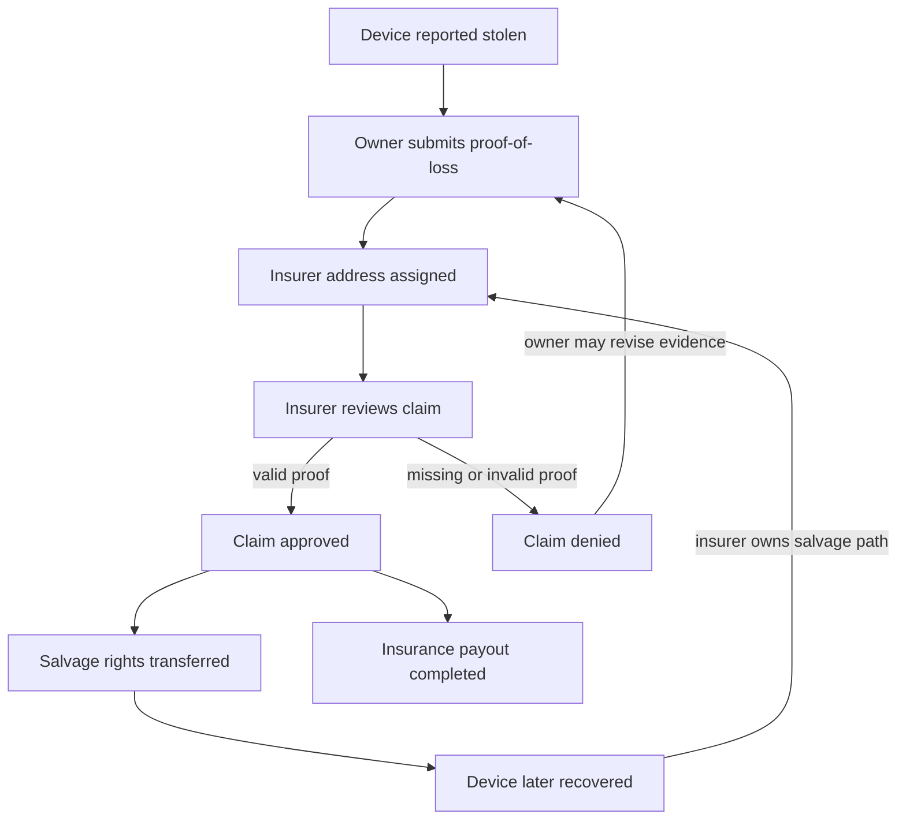

# Architecture Diagrams

This page provides version-controlled Mermaid diagrams for the Haven system architecture, bounty lifecycle, insurance flow, and USDC escrow interactions.

## Repository overview

Haven is split across three repositories:

- `Haven_Contracts`: Soroban smart contracts for device state, theft reports, recovery, insurance, and bounty records.
- `Haven_Frontend`: user interface for registration, stolen-device reporting, wallet signing, and recovery workflows.
- `Haven_Docs`: protocol, user, and contributor documentation.

## Device registration and stolen report data flow

The frontend should hash the IMEI before any on-chain write. The raw IMEI should stay off-chain.

## Bounty lifecycle

The bounty lifecycle turns a stolen-device report into a recoverable economic incentive. The target escrow model is deposit, lock, claim, and release.

## USDC escrow sequence

This sequence describes the intended escrow interactions for a USDC-funded recovery bounty.

## Insurance claim flow

Insurance flows connect a theft report to proof-of-loss, insurer authority, and possible salvage rights.

## Implementation notes

- Mermaid keeps the diagrams reviewable in Git and editable in future PRs.
- The diagrams describe the target protocol design; current contract pages note where token transfers and escrow release are still planned work.
- The frontend should continue to treat raw IMEI values as local-only data and submit only hashed identifiers to the contract.
